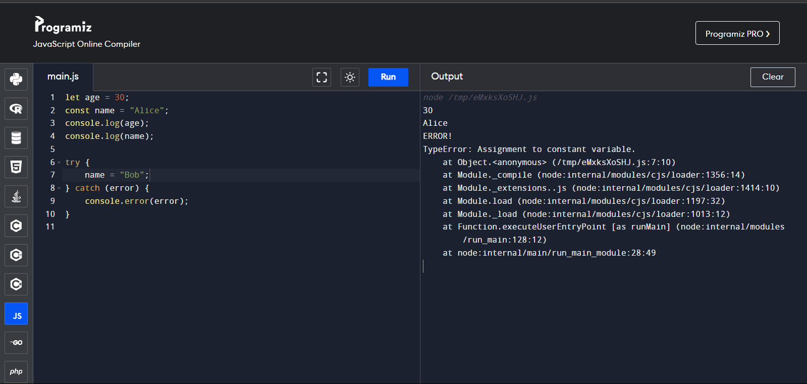

# ES6-Javascript-Assignment

1)Create two variables using let and const. The let variable should be named age and set to 30. The const variable should be named name and set to "Alice". Try to reassign the name variable and observe what happens.

**coding:**
```
let age = 30;
const name = "Alice";
console.log(age); 
console.log(name);

try {
    name = "Bob";
} catch (error) {
    console.error(error); 
}
```

